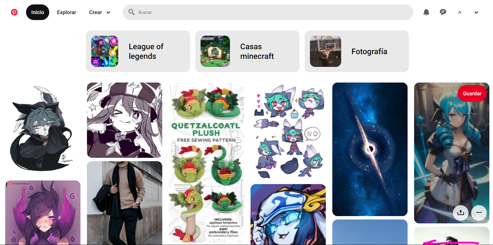

# my-pinterest-clon

En este proyecto compartimos bajo solicitud del bootcamp de DevF de desarrollador frontEnd, en el que se hace un clon de la plataforma de ideas de Pinterest, código HTML y CSS puro. Happy Coding! 👾🖖

Para el desarrollo de esta actividad se hizo uso de:

- HTML5
- CSS
- Flexbox
- Google Fonts
- Box-icons
- Pinterest

El trabajo se divide en la sección de nav, favoritos y mural. Con un mediaquery destinado a dispositivos móviles.
